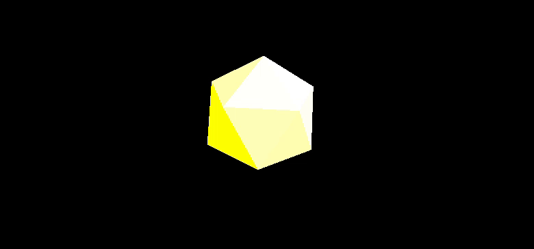

# Basic Three.js Example

This folder contains a simple Three.js project to help you get started with 3D graphics in the browser.

## Demo



## Files

- **index.html**  
  The main HTML file. It sets up the import map for Three.js and loads `main.js`.

- **main.js**  
  The JavaScript file where you create your Three.js scene, camera, objects, and renderer.

## How to Run

1. Make sure you have [Node.js](https://nodejs.org/) installed.
2. Open a terminal in this folder.
3. Run a local server, for example:
   ```
   npx serve
   ```
4. Open your browser and go to the address shown in the terminal (usually [http://localhost:3000](http://localhost:3000)).

## Notes

- The project uses CDN links for Three.js via an import map.
- You can edit `main.js` to experiment with different 3D objects and materials.
- Make sure your browser supports ES Modules and import maps (recent versions of Chrome, Edge, or Firefox).


---

Happy coding with Three.js!